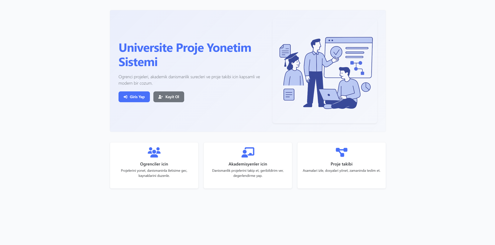
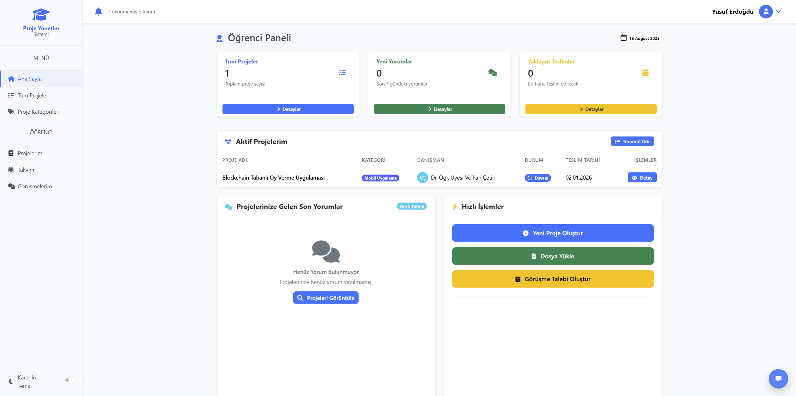
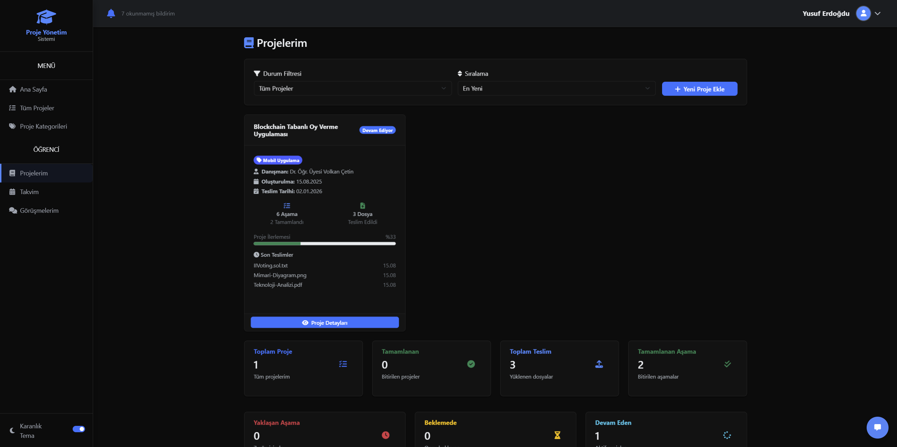
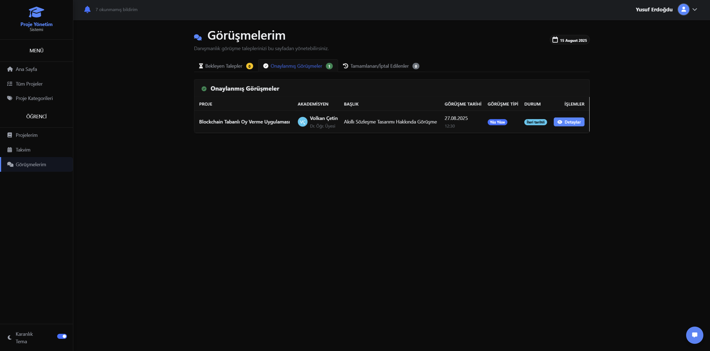
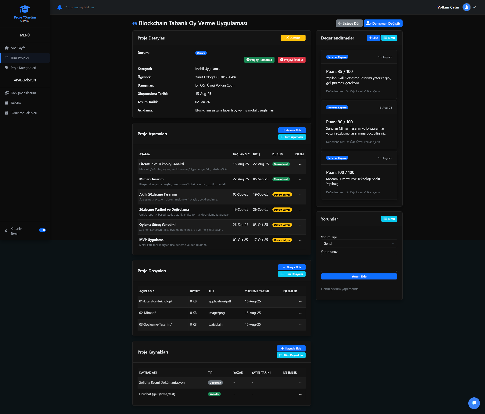
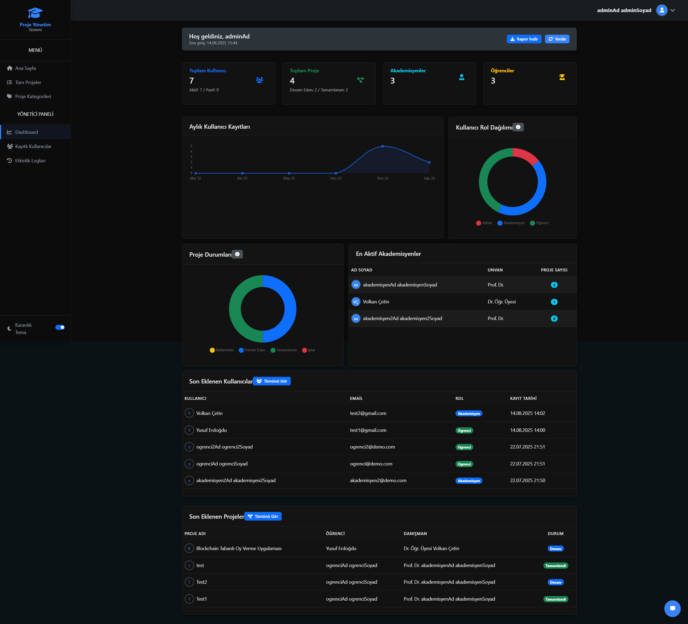

## Üniversite Proje Yönetim Sistemi

Üniversitede öğrenciler, akademisyenler ve yöneticiler için proje yönetimini kolaylaştıran web uygulaması. Proje atama, aşama takibi, dosya paylaşımı, değerlendirme, danışmanlık görüşmeleri, takvim ve bildirim gibi modülleri içerir.

### Ekran Görüntüleri













### Kullanılan Teknolojiler

- **Backend**: ASP.NET Core 8 (MVC + Razor Pages/Identity)
- **ORM**: Entity Framework Core (SQL Server ve/veya SQLite)
- **Database**: Azure Cloud
- **Kimlik Doğrulama**: ASP.NET Core Identity
- **Ön Yüz**: Bootstrap 5
- **AI Entegrasyonu (opsiyonel)**: Gemini 1.5 Flash
- **Diğer**: View Components, Middleware

### Veritabanı ve Yapılandırma

- Varsayılan bağlantı dizesi `UniversiteProjeYonetimSistemi/appsettings.json` içindedir. Geliştirme ortamında bunu kullanıcı gizleri (User Secrets) veya `appsettings.Development.json` ile **override** etmeniz önerilir.
- EF Core göçleri `UniversiteProjeYonetimSistemi/Migrations` klasöründedir.

Örnek bağlantı dizeleri:

```text
SQL Server (LocalDB): Server=(localdb)\\MSSQLLocalDB;Database=UniversiteProjeDb;Trusted_Connection=True;MultipleActiveResultSets=true;TrustServerCertificate=True

SQLite: Data Source=app.db
```

Gemini anahtarı için (opsiyonel):

```text
Gemini:ApiKey = <YOUR_API_KEY>
Gemini:Model  = gemini-1.5-flash
```

### Kurulum ve Çalıştırma

1. .NET 8 SDK'yı kurun.
2. Bağımlılıkları indirin:
   ```bash
   dotnet restore
   ```
3. Geliştirme ayarlarını gizli olarak tanımlayın (önerilir):
   ```bash
   cd UniversiteProjeYonetimSistemi
   dotnet user-secrets init
   dotnet user-secrets set "ConnectionStrings:DefaultConnection" "<CONNECTION_STRING>"
   # Opsiyonel AI
   dotnet user-secrets set "Gemini:ApiKey" "<YOUR_API_KEY>"
   ```
4. Veritabanını oluşturun/güncelleyin:
   ```bash
   # Eğer sisteminizde yoksa: dotnet tool install --global dotnet-ef
   dotnet ef database update
   ```
5. Uygulamayı çalıştırın:
   ```bash
   dotnet run --project UniversiteProjeYonetimSistemi
   ```

### Başlıca Modüller

- **Kullanıcı Rolleri**: Yönetici, Akademisyen, Öğrenci
- **Proje Yönetimi**: Proje oluşturma, atama, aşama takibi, kaynak ve dosya yönetimi, yorumlar, değerlendirmeler
- **Danışmanlık Görüşmeleri**: Talep/Onay akışı ve zaman durumu güncellemesi
- **Takvim**: Görüşmeler ve önemli tarihler
- **Bildirimler**: Okunmamış bildirim sayacı ve listeleme

### Geliştirme İpuçları

- Çalışma zamanı ayarları: `UniversiteProjeYonetimSistemi/appsettings*.json`
- Statik dosyalar ve tema: `UniversiteProjeYonetimSistemi/wwwroot`
- Görünümler: `UniversiteProjeYonetimSistemi/Views`
- Denetleyiciler: `UniversiteProjeYonetimSistemi/Controllers`
- Servisler: `UniversiteProjeYonetimSistemi/Services`

> Not: Üretim ortamında gizli bilgiler (DB bağlantı dizesi, API anahtarları) depo içine eklenmemelidir. Kullanıcı gizleri, ortam değişkenleri veya güvenli bir giz yönetimi kullanın.


